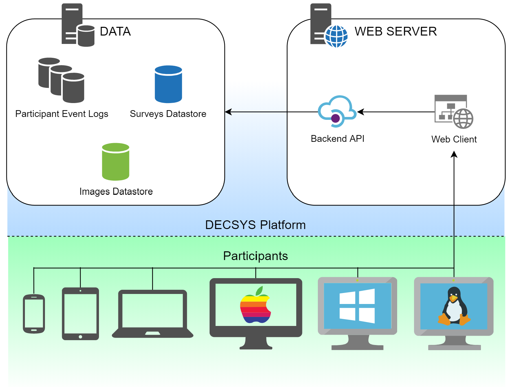

DECSYS is a straight foward client/server web application.

Running a Survey makes sense in a client/server model:
- The Server is the source of the Survey material, and records the results.
    - The app that is connected to to take a Survey
    - In the real world, the person handing out the Survey papers, and collecting them at the end of the session
- The clients are each participant
    - They fill out the Survey from their own computer
    - Or from their own seat with their own pen.

DECSYS is a web app for two main reasons:
- It's desirable to be able to run Surveys online.
- The Web, and its use of HTTP, is probably the single best understood application of a client/server model in the world.

## General Architecture

DESCSYS consists architecturally of 2 main elements:

1. The Web Server
1. Data Storage

Each of these breaks down a little further, and the implementation may differ in different environments, such as between **Workshop** and **Hosted** modes. But at its heart, there is always a web accessible service, and a means of data storage.

While the diagram shows these elements as separate, that's really a logical separation for categorisation; they may or may not be physically separated, and their contained areas may or may not also be physically separated (e.g. different data storage locations).

### The Web Server

The Web  is really DECSYS itself.

It consists technically of 2 applications:
- A Backend API
- A Frontend Interface

### Data Storage

There are three main types of data that DECSYS stores currently:
- Surveys
    - Survey configuration data
    - Instances of Surveys
- Images
    - Image uploads used in Surveys.
        - As binary data rather than text these are likely to want to be stored differently in practice
        - (i.e. not in a database)
- Participant Event Logs
    - Every event recorded by each participant of a Survey Instance.
